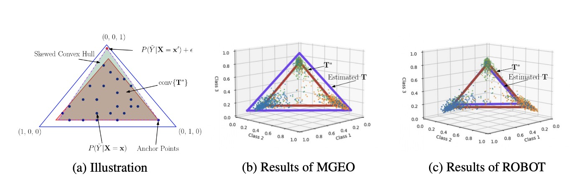

# A Holistic View of Label Noise Transition Matrix in Deep Learning and Beyond (ROBOT)

This repository contains the source code for the paper A Holistic View of Label Noise Transition Matrix in Deep Learning and Beyond.
Our paper is available on OpenReview: [link](https://openreview.net/pdf?id=aFzaXRImWE).

## Table of Contents

- [Installation](#installation)
- [Reproducing Results](#reproducing-results)

## Installation
To use this project, you will need to install the following packages:

- PyTorch: `pip install torch`
- wandb: `pip install wandb`

## Reproducing Results

To reproduce the results from our paper, follow these steps:

1. Download the datasets (cifar10, cifar100).
2. Train the model by running the following commands:

Run the code with the following commands:
```
#cifar10 experiment with uniform and flip noises
python robot_main.py --dataset cifar10 --corruption_ratio 0.5 --analyze --meta_lr 5e-2 --wandb --start_correction 0 --runs_name 0.5_forward_rce_uniform --loss forward --print_predictions --start_updating_T 20 --max_epoch 85 --outer_obj rce --corruption_type uniform
python robot_main.py --dataset cifar10 --corruption_ratio 0.45 --analyze --meta_lr 5e-2 --wandb --start_correction 0 --runs_name 0.45_forward_rce_flip --loss forward --print_predictions --start_updating_T 20 --max_epoch 85 --outer_obj rce --corruption_type flip1

#cifar100 experiment with uniform and flip noises
python robot_main.py --dataset cifar100 --corruption_ratio 0.2 --analyze --meta_lr 5e-2 --start_correction 0 --loss forward --start_updating_T 20 --lr 0.05 --weight_decay 1e-3 --momentum 0.9 --T_init 4.5 --batch_size 128 --meta_optim adam --project rce_T_revision_cifar100_partial_inner0.05 --runs_name 0.2_outlr5e-2_adam_mae --wandb --network r34 --num_meta 0 --max_epoch 200 --outer_obj mae --corruption_type flip1 --meta_batch_size 512
python robot_main.py  --dataset cifar100 --corruption_ratio 0.45 --analyze --meta_lr 1e-2 --start_correction 0 --loss forward --start_updating_T 10 --lr 0.05 --weight_decay 1e-3 --momentum 0.9 --T_init 4.5 --batch_size 128 --meta_optim adam --project rce_T_revision_cifar100_partial_inner0.05 --runs_name 0.45_outlr3e-3_adam_mae --wandb --network r34 --num_meta 0 --max_epoch 200 --outer_obj mae --corruption_type flip1 --meta_batch_size 512
```

### Example Results

